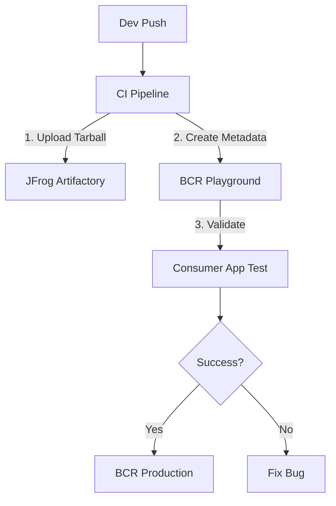

# 📘 Internal Bazel Registry & CI/CD Architecture

## 1. Overview

This project simulates a corporate environment for managing internal C++ dependencies using **Bazel (Bzlmod)**. It demonstrates how to decouple source code from artifact storage and how to manage dependency lifecycles using segregated registries (**Playground** vs. **Production**).

### Key Components

* **Source of Truth:** Git repositories (`repos/`).
* **Artifact Storage:** JFrog Artifactory Mock (`infrastructure/jfrog-storage`).
* **Registries:**
* **Playground:** For CI/CD, unstable builds, and Release Candidates (RC).
* **Production:** For stable, approved releases used by all developers.


---

## 2. Directory Structure

Below is the repository layout with explanations for each component's role in the infrastructure.

```text
.
├── health_check.py                # Tool to validate registry integrity (SHA256 & Connectivity)
├── infrastructure/                # Managed by Platform Engineering
│   ├── jfrog-storage/             # Mock Artifactory (stores .tar.gz binaries)
│   ├── bcr-playground/            # Registry for CI/Testing (High volatility)
│   │   └── modules/               # Bzlmod metadata (source.json, MODULE.bazel)
│   └── bcr-prod/                  # Registry for Production (Stable/Immutable)
└── repos/                         # Application Source Code
    ├── platform-math-lib/         # PRODUCER: A shared library (C++)
    │   └── ci_pipeline.sh         # CI Script: Builds, Packs, Uploads, and Registers
    └── backend-app/               # CONSUMER: An app that depends on platform-math-lib
        └── ci.bazelrc             # Config to switch Bazel to Playground mode

```

---

## 3. Workflows

### A. The Producer Workflow (Publishing)

**Goal:** Publish a new version of a library to the Playground registry for testing.

1. **Versioning:** The CI pipeline injects the version (e.g., `1.0.0-rc1`) into `MODULE.bazel`.
2. **Packaging:** Source code is archived into a `.tar.gz` (deterministically).
3. **Storage:** The archive is uploaded to the Artifactory (Mock).
4. **Registration:** The pipeline calculates the **SHA256 checksum** and writes a `source.json` entry in the `bcr-playground`.

**Command (Simulation):**

```bash
cd repos/platform-math-lib
# Usage: ./ci_pipeline.sh <version>
./ci_pipeline.sh 1.0.0-rc1

```

### B. The Consumer Workflow (Consumption)

**Goal:** Use the library in an application (`backend-app`).

There are two modes of operation controlled by Bazel flags:

#### Mode 1: Production (Default)

Used by developers for day-to-day coding. Connects *only* to `bcr-prod`.

* **Config:** `.bazelrc` (default).
* **Command:** `bazel run //:server`

#### Mode 2: CI / Migration (Testing)

Used by CI servers to validate a new RC version before promotion. It prioritizes `bcr-playground`.

* **Config:** `ci.bazelrc`.
* **Command:**
```bash
# Note: Flag must come BEFORE the verb 'run'
bazel --bazelrc=ci.bazelrc run //:server

```


### C. The Promotion Workflow (Playground -> Prod)



---

## 4. Maintenance & Validations

### Handling Checksum Mismatches

In this simulation, re-running the CI pipeline regenerates the `.tar.gz` (changing its timestamp and SHA256). If the Registry points to Hash A, but Artifactory has Hash B, Bazel will fail.

**Resolution:**

1. **Re-publish:** Run `ci_pipeline.sh` to update the registry with the new file's hash.
2. **Clean Cache:** Force the consumer to re-download the file.
```bash
bazel clean --expunge

```


### Registry Health Check

A Python script (`health_check.py`) is provided to audit the registries.

**Capabilities:**

* Validates JSON syntax.
* Checks HTTP connectivity to the artifact URL.
* **Downloads and verifies SHA256 integrity** against `source.json`.

**Usage:**

```bash
# Check Playground
python3 health_check.py --registry infrastructure/bcr-playground

# Check Production
python3 health_check.py --registry infrastructure/bcr-prod

```

---

## 5. Configuration Reference

### `source.json` Format

Located in: `modules/<name>/<version>/source.json`

```json
{
    "integrity": "sha256-<ACTUAL_FILE_HASH>",
    "url": "http://localhost:9000/corp_math-1.0.0-rc1.tar.gz",
    "strip_prefix": ""
}

```

### `ci.bazelrc` Strategy

Located in: `repos/backend-app/ci.bazelrc`

```text
# 1. Look in Playground first (for RC versions)
common --registry=file://%workspace%/../../infrastructure/bcr-playground

# 2. Fallback to standard configuration (Prod + Google BCR)
import %workspace%/.bazelrc

```